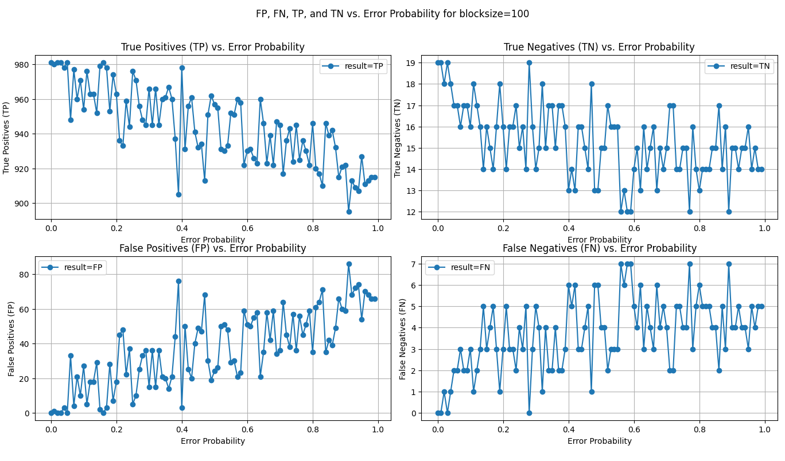
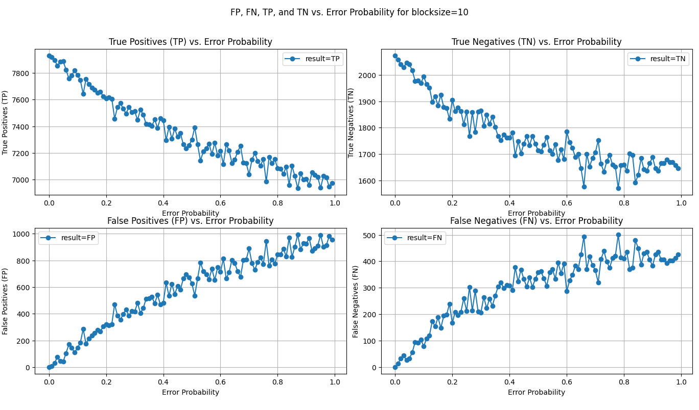

## hm

- questions
  - how to determine block size?
  - makes sense on random data?
  - is the fluctuation bad?
- Ideas
  - try with clustered or skewed Data
  - use Precision, Recall, F1-score again
- U=1000, |data| = 100
  - lots of fluctuation
  - result not reproducible
  - 
- U=1000, |data| = 100
  - smaller block size better
  - 