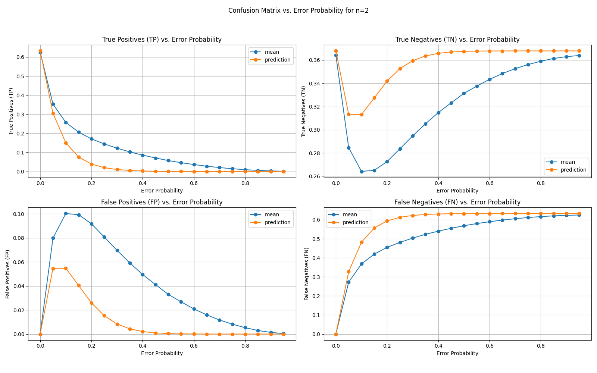
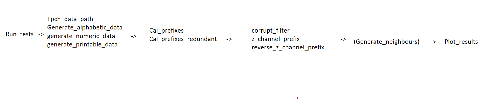

### Working Log

| Date                    | Progress                                                                                                                                                                            | Thoughts/Details                                                                                                                                                                                                                                        |
|-------------------------|-------------------------------------------------------------------------------------------------------------------------------------------------------------------------------------|---------------------------------------------------------------------------------------------------------------------------------------------------------------------------------------------------------------------------------------------------------|
| 2025-2-21               |                                                                                                                                                                                     |                                                                                                                                                                                                                                                         |
| 2025-2-19               | - Laufzettel  - started key-value implementation                                                                                                                                |                                                                                                                                                                                                                                                         |
| 2025-2-18               | new structure without MinMaxFilter, with research Chapter                                                                                                                          | need second filter with references                                                                                                                                                                                                                      |
| 2025-2-7                | meeting with Max                                                                                                                                                                    | - what query answers my filter? - think about mapping: correct or incorrect mapping - invalids: look at which bits make character invalid - set ven diagram not clear (better names, examples)                                              |
| 2025-2-6                | make slides                                                                                                                                                                         | - only include what could be relevant - how to continue? - is my theses registered?                                                                                                                                                             |
| 2025-2-5                | make length filter                                                                                                                                                                  | problematic if length does not variate much, probably not a useful filter                                                                                                                                                                               |
| 2025-2-4                | look for other filters                                                                                                                                                              | length or modulo filter                                                                                                                                                                                                                                 |
| 2025-2-3                | look over MinMax writing and invalids                                                                                                                                               | which formula is good?, does the filter make sense?                                                                                                                                                                                                     |
| 2025-1-31               | again different invalid formulas                                                                                                                                                    |                                                                                                                                                                                                                                                         |
| 2025-1-29               | stopped with MinMax filter, looked at invalid formula again                                                                                                                         | MinMax Filter maybe not useful?                                                                                                                                                                                                                         |
| 2025-1-28               | started with the MinMaxFilter                                                                                                                                                       | wrote description of idea and code  how to chose block size?  how to generate data???                                                                                                                                                           |
| 2-25-1-27               | found another invalid formular  workaround for u!=v                                                                                                                             | (1-(1-p*(28/128))^(n*7))=(1-(1-p*(156/256))^(n*8/pi))???  look for better fp formula                                                                                                                                                                |
| 2025-1-24               | still problems for u!=v                                                                                                                                                             | to many FP predictions if u>v                                                                                                                                                                                                                           |
| 2025-1-23               | flip u to v not correctly if sizes of u and v change                                                                                                                                |                                                                                                                                                                                                                                                         |
| 2025-1-22               | invalid = (1-(1-p*(28/128))^(n*7))                                                                                                                                                  | why 7???                                                                                                                                                                                                                                                |
| 2025-1-21               | meeting                                                                                                                                                                             | work on formulas again                                                                                                                                                                                                                                  |
| 2025-1-16               | writing about neighbours  short meeting                                                                                                                                         | need to generate graphs, fix code                                                                                                                                                                                                                       |
| 2025-1-15               | writing about redundancy and testing optimisation                                                                                                                                   | seems to be good  ToDo: liberal for d=2  ToDo: with more majorities for d>4                                                                                                                                                                     |
| 2025-1-14               | writing about formulas for Confusions matrix                                                                                                                                        | with more iterations the simulation and prediction do not overline  still a problem???                                                                                                                                                              |
| 2025-1-13               | continued with writing mathematical description                                                                                                                                     |                                                                                                                                                                                                                                                         |
| 2025-1-9                | started writing                                                                                                                                                                     | Prefix introduction and simulation description                                                                                                                                                                                                          |
| 2025-1-8                | - found problem in my formulas - worked on optimisation with redundancy                                                                                                         | run experiment multiple times again to validate formulas maybe more optimisation possible?                                                                                                                                                          |
| 2025-1-7                | - organised code  - run experiment on server  - new redundancy approach                                                                                                     |  printable data, run experiment 100 times, size u,v=10.000  - formulas seam to be off                                                                                                                      |
| 2025-1-6                | found formulas for the filter with redundancy                                                                                                                                       | the formulas still seam to miss something   maybe they`re good enough???                                                                                                                                                                            |
| 2024-12-18              | found formulas for the Confusions matrix                                                                                                                                            | - next step should be to run experiment multiple times, calculate mean and standard deviation  - Ven Diagrams in PrefixResults.Math                                                                                                                 |                                                                                                                                                                                                                                                      
| 2024-12-17              | found some probability`s                                                                                                                                                            | maybe some Ven-Diagrams could help?                                                                                                                                                                                                                     |
| 2024-12-16              | started with new idea for the calculation of the Confusionmatrix                                                                                                                    | maybe need approximation of set sizes                                                                                                                                                                                                                   |
| 2024-11-27 - 2024-12-15 | took a break                                                                                                                                                                        | - frustrated - unmotivated                                                                                                                                                                                                                          |
| 2024-11-26              | read Towards Exact Analysis of EDF-Like Scheduling  Meeting                                                                                                                     | - work on FP, TN first  - trie making code different  - remove Prefixes that are no ASCII  - maybe double some characters instead of whole Prefixes  - I forgot the prob, that a prefix in P flips to another prefix in P               |
| 2024-11-25              | tried math again  wrote down thoughts on MinMaxFilter                                                                                                                           | TN and FP still wrong    should find literature                                                                                                                                                                                                     |
| 2024-11-21              | tested neighbouring bit words                                                                                                                                                       | not very good, needs more knowledge about which bit flips (weighs on prefixes)                                                                                                                                                                          |
| 2024-11-20              | tested redundancy                                                                                                                                                                   | not very good, needs lots of space to be good                                                                                                                                                                                                           |                                                                                                                                                                                                                                                        
| 2024-11-19              | worked on the redundancy (in PrefixResults.Redundancy) and neighbouring bit words                                                                                                   | - math still a Problem for TN and FP  - math also for Redundancy bad  - only simple version for redundancy, maybe more is better?  - neighbours to many, does this even make sense?                                                         |
| 2024-11-18              | checked my math again                                                                                                                                                               | did not get better                                                                                                                                                                                                                                      |
| 2024-11-14              | - found nearly good explanation for FP                                                                                                                                              | in PrefixResults.Math                                                                                                                                                                                                                                   |
| 2024-11-13              | - read beginning of paper  - changed calculation of confusionmatrix                                                                                                             | PrefixResults.thoughts13.11                                                                                                                                                                                                                             |
| 2024-11-12              | - new implementation of MinMaxFilter                                                                                                                                                | - seams to be much better than prefix filter  - only for numeric data                                                                                                                                                                               |
| 2024-11-8               | found connection between choice of n and datasize                                                                                                                                   | maybe useful for FN and FP approximation?                                                                                                                                                                                                               |
| 2024-11-7               | tried finding functions for FN and FP                                                                                                                                               | for some n and some Datasize the results make no sense  if every possible prefix in Filter -> no TN  if to little of the possible prefixes in Filter ...                                                                                        |
| 2024-11-5               | - added test results to Results 5.11 (better Plots) - added cal_prefixes_redundant method                                                                                       | redundant Filter not better: - check Confusionmatrix calculation again - maybe more redundancy?  how can the behavior be described?                                                                                                         |
| 2024-10-31              | - run tests with different parameters  -results in Results32.10                                                                                                                 | - to many Graphs, make more subplots  - show change of FP, FN with different prefix length???  - maybe show difference per datatype???  -codestructure:   - TODO: cal_prefixes_redundant and fix generate_neighbours |
| 2024-10-30              | adjust code to changes                                                                                                                                                              |                                                                                                                                                                                                                                                         |
| 2024-10-28              | give presentation                                                                                                                                                                   |                                                                                                                                                                                                                                                         |
| 2024-10-27              | practise presentation                                                                                                                                                               | maybe add connection from Filter to Data                                                                                                                                                                                                                |
| 2024-10-26              | - change structure of code  - add random generated Data                                                                                                                         |                                                                                                                                                                                                                                                         |
| 2024-10-25              | improve slides                                                                                                                                                                      |                                                                                                                                                                                                                                                         |
| 2024-10-23              | - Meeting - prepared slides                                                                                                                                                     | - maybe prepare some results for slided                                                                                                                                                                                                                 |
| 2024-10-22              | - checking TP without z-channel  - predicted number of Bit FLips correct  - results happened because of redundancy -> make prefix a set - maybe found lower Bound for TP | - connection between num_Flips and TP???    - predicted Number of TP=N*(1-P)^B                                                                                                                 |
| 2024-10-19              | - checking TP and FN for z-channel again -> first errors at p=0.3                                                                                                               |    - expected number of bit-flips = N * B * P                                                                                                                                        |
| 2024-10-18              | - Meeting, wrote memory log in README - tried getting different result for Prefix filter, still first FN at p=0.2                                                               | - results depend on Data? - maybe compare Prefix filter with z-channel and without  - check code again                                                                                                                                          |