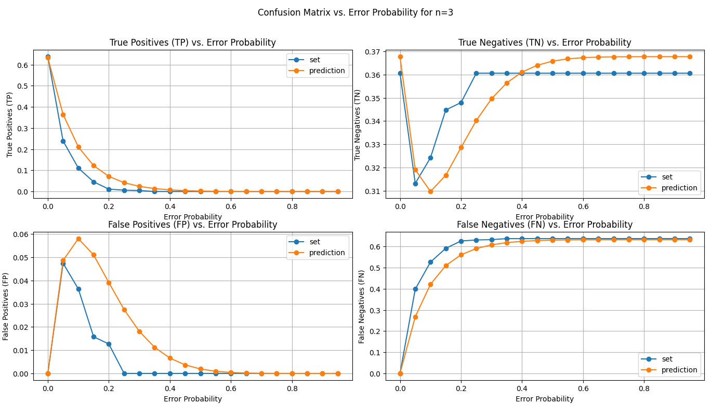
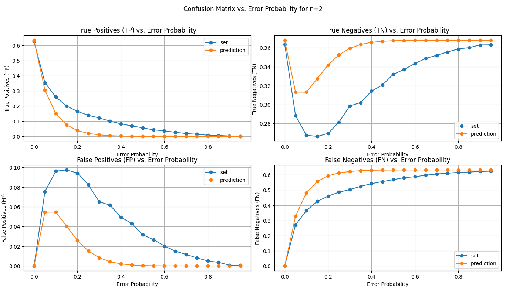
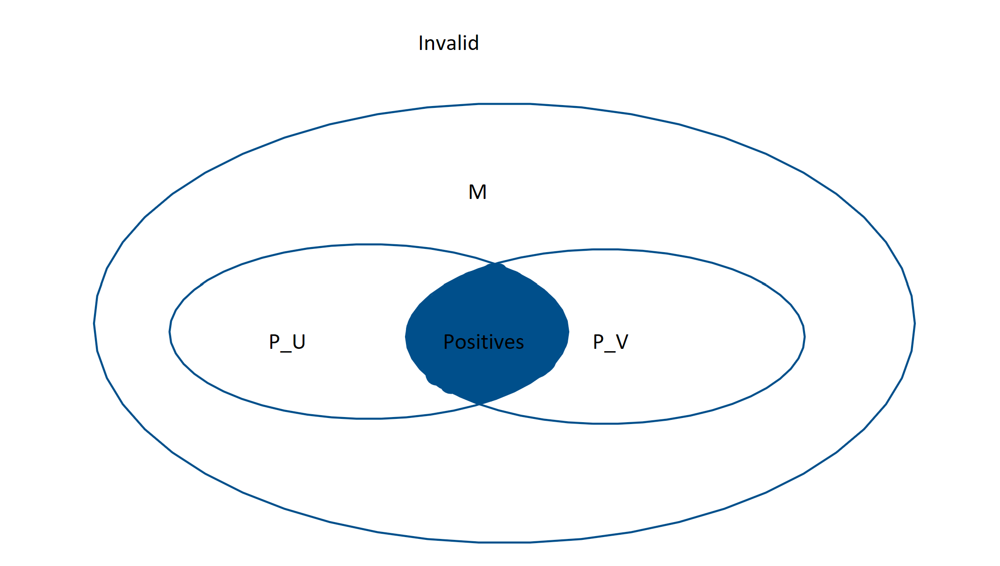
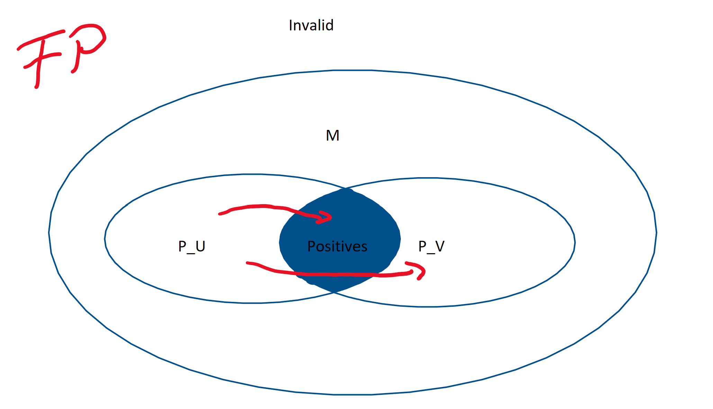
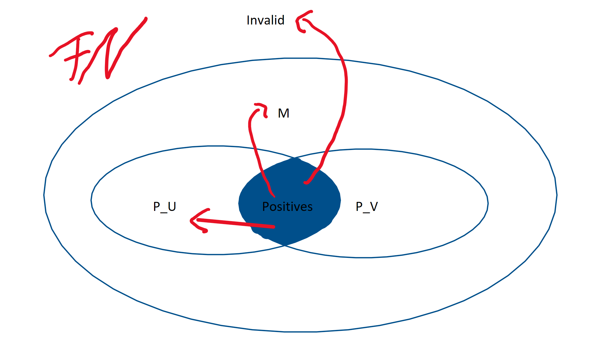
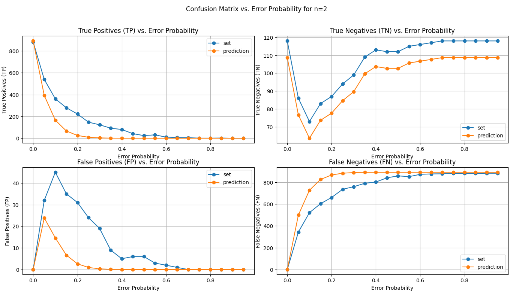

## Mathematical Explanations for Confusion Matrix

- **Variables**
  - `U` = Universe that builds filter
  - `V` = random Data
  - `n` = number of Characters per Prefix
  - `B = 8*n` = number of Bits per Prefix
  - `M` = maximum number of Prefixes (`num Characters ** n`)
  - `p` = Error Probability
- **Approximations**
  - Number of Prefixes `P = M*(1-(1-1/M)**U)`
  - Number of Bit Flips `F = P*B*p`
  - Number of Positives `|Positives| = |data| * (1-(1-1/M)**U)`
  - Number of Negatives `|Negatives| = |data| * (1-1/M)**U`
  - Number of Collisions `(U(U-1))/2M` 
  - Union of U and V `= M * (1 - (1 - (1 / M)) ** (u + v))`
  - intersection of U and V `= P_U + P_V - u_union_v`
- **Probability's**
  - No Bit Flip `(1-p)**B`
  - influence of invalid Flips `invalid = 1 - (1 - (1 - p) ** (n * math.log(num_characters)))`
  - of a bit flip `bit_flip = 1 - (1 - p) ** (n * math.log(num_characters))`
  - flip_negatives_to_v `= apprx_num_negatives * (P_V / M) * bit_flip * invalid`
  - flip_positives_to_negatives `= apprx_num_positives * ((M - u_intersect_v) / M) * bit_flip * invalid`
  - flip_positives_to_invalid `= apprx_num_positives * invalid`
- **Confusions matrix new**
  - `TP = |Positives| - (flip_positives_to_negatives + flip_positives_to_invalid)`
  - `TN = |Negatives| - flip_negatives_to_V`
  - `FP = flip_negatives_to_V`
  - `FN = flip_positives_to_negatives + flip_positives_to_invalid`
  - |U|=5000, |V|=5000, alphabetic data:
  - |U|=1000, |V|=1000, numeric data:  
  - |U|=10000, |V|=10000, printable data:
- **Explanation**
  - without bit flips: 
  - FP: 
  - FN: 
- **Thoughts**
  - stop using z-channel. Only simulate bit flips that can occur everywhere. 
  Differentiating and adjusting to reality to time-consuming. Only mention in Outlook.
  - only using printable data for test. Maybe show some differences in the explanation of the experiment.
  Results should not differ too much and printable data includes alphabetic and numeric data.
  - Formulas are good enough for me, but not completely accurate. The scales are important to notice/
- **Confusions matrix old**
  - `TP = |Positives| * (1-p)**B`
  - `FN = |Positives| * (1-(1-p)**B)`
  - `TN = |Negatives| - FP` (to simple, still looking for other explanation)
  - `FP = |Negatives| * (1/(1-p)**B) * (P/M) * (1-p)**B` (not fully correct)
  - U=6000, |data| = 1000, alphabetic data: 