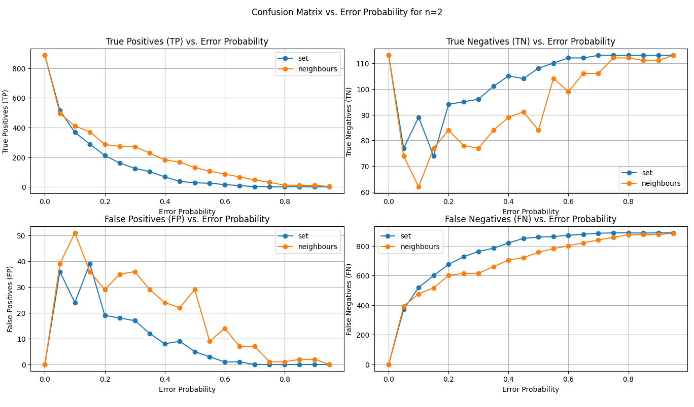

## First thoughts
- if `max_distance=0` the optimized filter behaves similarly to the standard Prefix Filter
- standard filter performance here is the baseline for comparison with optimizations
- if added all words with `max_distance` different Bits the filter could be larger than `max_num_prefixes`
  - then the Filter contains all possible prefixes
  - no TN, lots of FP
  - not the purpose of the Filter
- added only as many Words as Bit Flips happened
  - only little bit better than Filter without neighbors
  - for low error probability not manny neighbors get added
- begin adding Words with smallest Hamming Distance
  - again a bit better
  - still not much better for low error probability
    - very unlikely that bit flips are reversed
    - makes more sense when we know were bit flips happen
    - maybe add probability that this word has an error (makes only sense if the errors are no longer modeled as Bernoulli)
- U=6000, |data| = 1000, alphabetic data, |prefixes| = 2412, |prefixes neighbours| = 13 479