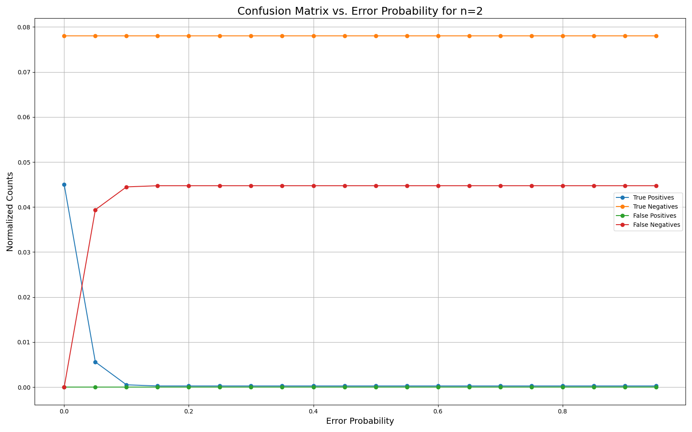
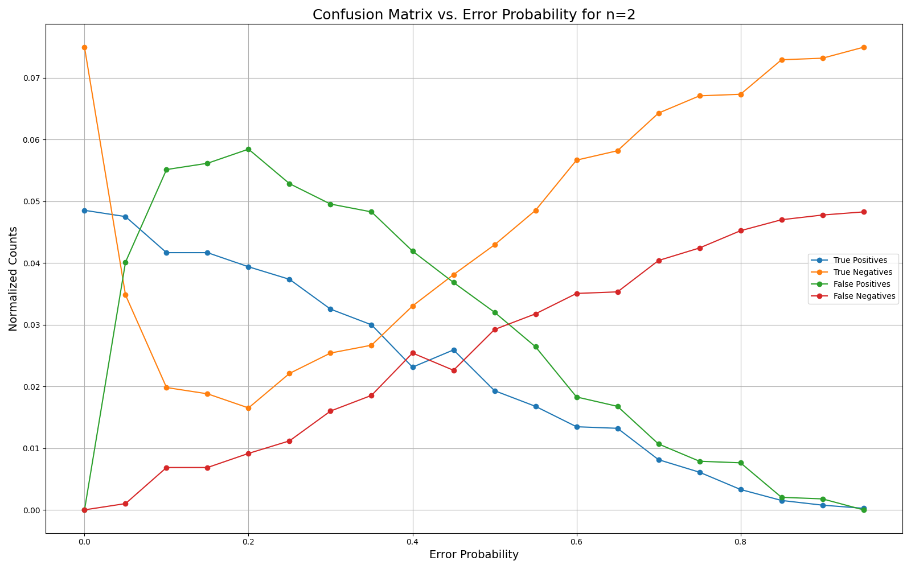
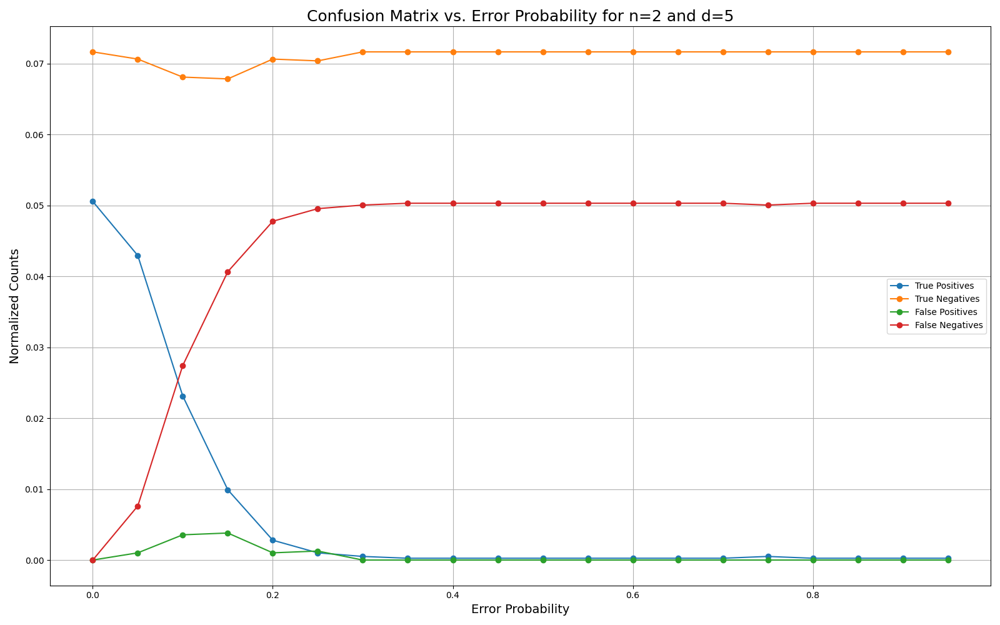
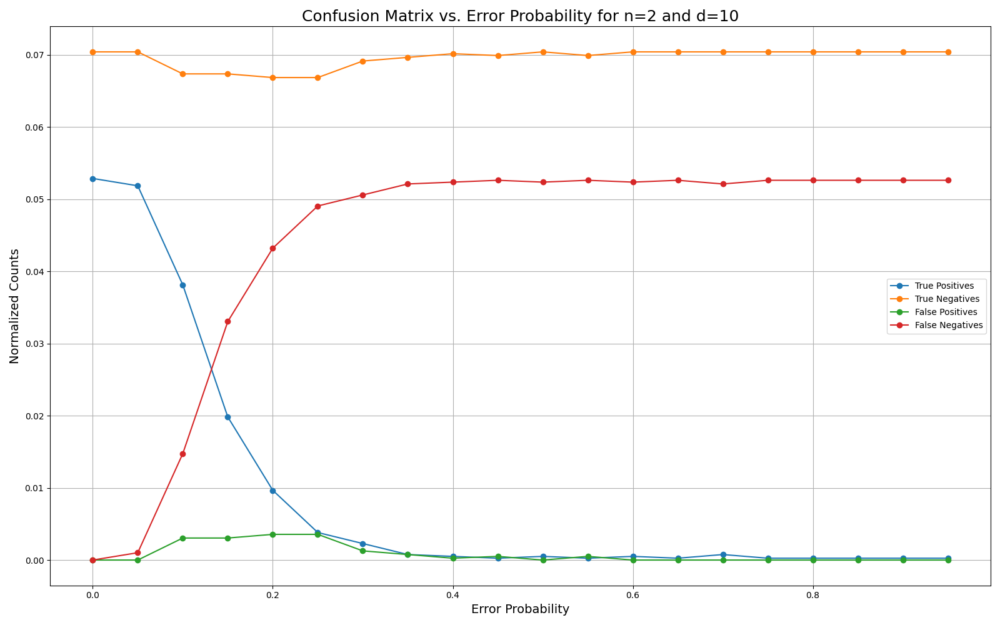
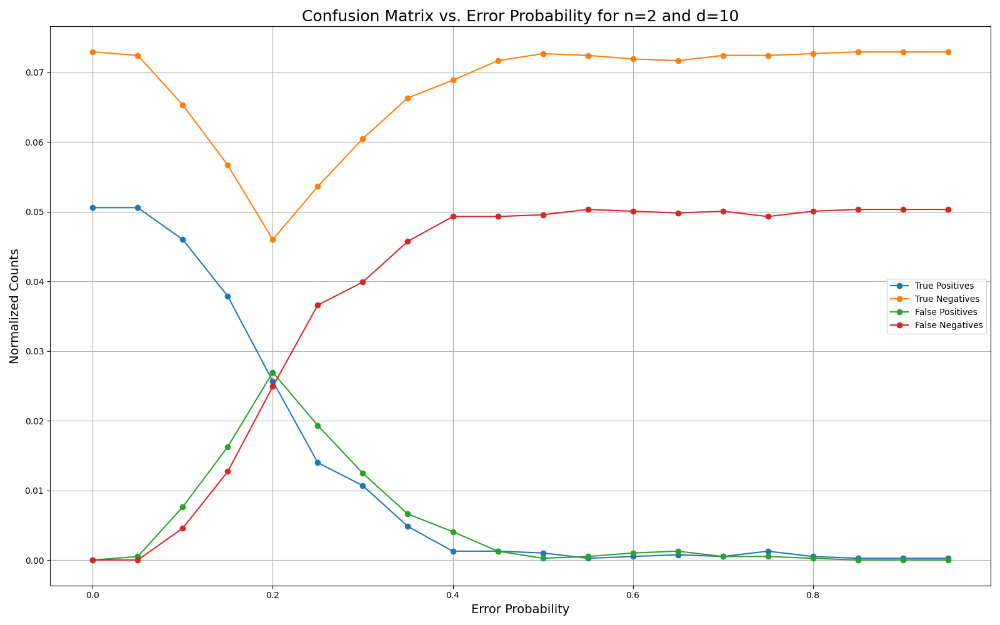
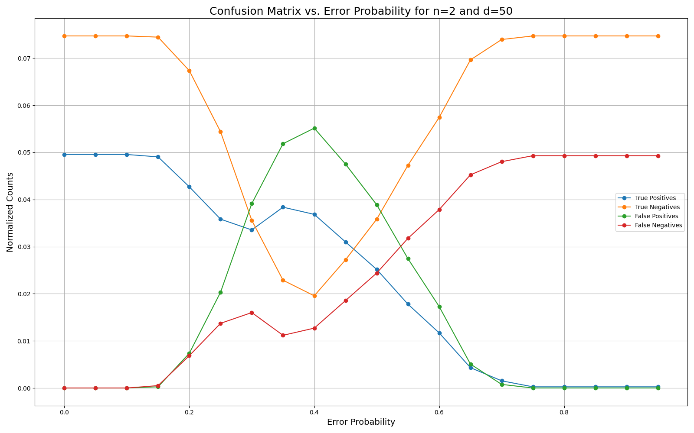
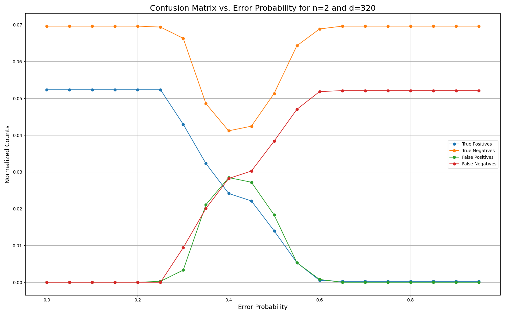
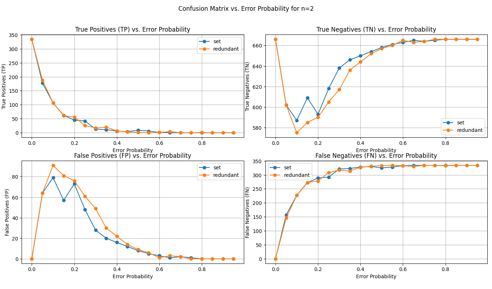
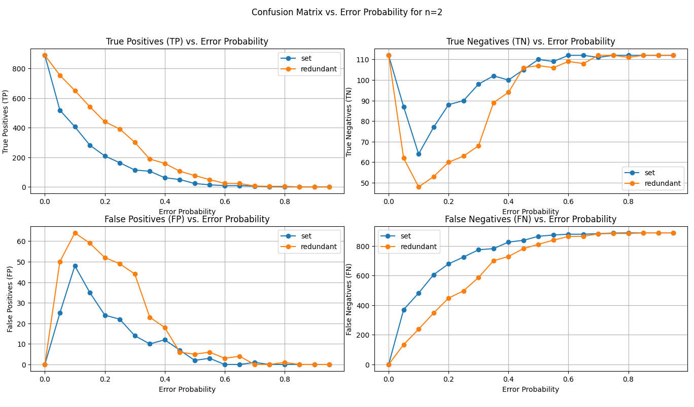

## New approach
- save every char per prefix d times as new filter
- try to restore old prefixes
  - if all d chars are the same it is most likely that no bit flip happened and this is the true char
  - if there are different chars we can create maybe prefixes where it is possible that one of them is a true prefix
## How to deal with maybes?
#### in a conservative way, where no maybes are saved as true prefixes:
- for d=3, u=5000, v=500, printable data
- no FPs, all TN are detected correctly
- lots of FN, very bad TP rate

#### very optimistic, where all maybes are also saved as TPs:
- for d=2, u=5000, v=500, printable data
- lots of FPs, not all TN are detected
- closer to linear decrease of TPs and linear increase of FN
- this is the best it can get for this d for the TPs and FN but the worst for FP and TN

#### Idea to restore maybes 1
- when there is a majority of one char it is more likely to be the correct char
- this is to be used with the conservative evaluation
- small FP rate which decreases the TN rate due to errors
- better TP rate for low error probability's

- this gets better for higher d`s till p=0.2
- than there are too many bit flips

- this can be improved when majority's that are not unique are both added too
- the number of FPs increases

- why the sudden change in behaviour at p=0.2?? (for d=5 it is at p=0.1, if d=50 it is at p=0.4)

- it does not get better
- maybe after p=0.4 every char contains a bit flip
- than all prefixes get categorised as maybes and are not in the filter anymore
- which d is optimal?? How good should the TP rate be, how bad can the FP rate be???

#### Idea to restore maybes 2
- when one option already is in the true prefixes it can be ruled out and the likeliness of the other options increases

## Old thoughts
- I used simple redundancy where every entry creates one prefix (`len(prefix)=len(Universe)`)
- when `len(prefixes)` is close to `len(prefixes_redundant)` only a small difference is visible:
- the set(blue line) is the Filter without redundancy and the orange line ist the filter with redundancy 
 u=1000, data2=1000, len(prefixes)=827, len(prefixes_redundant)=1000, alphabetic Data
- with bigger difference: u=6000, data2=1000, len(prefixes)=2426, len(prefixes_redundant)=6000
- TP and FN are a bit better, but TN and FP are worse with this kind of redundancy
## Math
- only changed `P_U` to `|data1|` and `P_V` to `|data2|`
- 
### Explanation
- more TP because not every prefix of common prefixes gets changed
- less FN because of the same reason
- more FP because there are more prefixes in general that can be flipt
- probability that a Bit Flip changes a prefix from u to a prefix only in data2 is bigger
- less TN because some prefixes from data2 become matches due to FP
### Ideas
- find Filter size that has only few errors at low p
- lot`s of redundancy needed for Filter to be good 
  -> maybe to big
- on real data some prefixes are more common
  - only use them redundantly
- use redundancy different. Double all chars  and check if there still the same. Than add maybe matches