## which n ist best?

### FP vs. FN without second dataset

| Variables                                                                                         | Methods                                                          | Graphs                        |
|---------------------------------------------------------------------------------------------------|------------------------------------------------------------------|-------------------------------|
| N = 10 000  min_length = 5  max_length = 10  error Probability range (0.0, 0.5, 0.05) | Data = alphabetic  Filter = normal   corruption = normal | 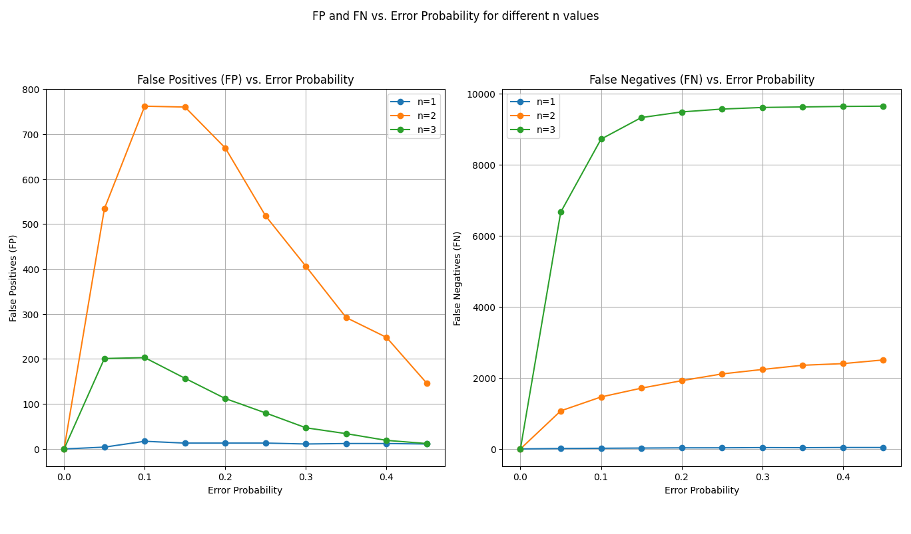 |
| N = 10 000  min_length = 5  max_length = 10  error Probability range (0.0, 0.5, 0.05) | Data = numeric  Filter = normal   corruption = normal    | 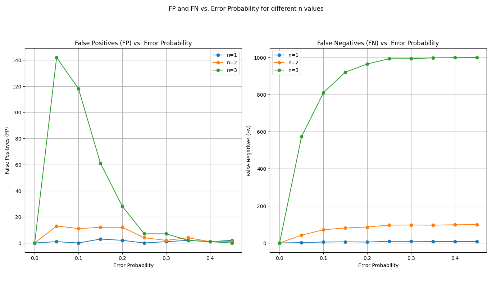 |
| N = 10 000  min_length = 5  max_length = 10  error Probability range (0.0, 0.5, 0.05) | Data = printable  Filter = normal   corruption = normal  | 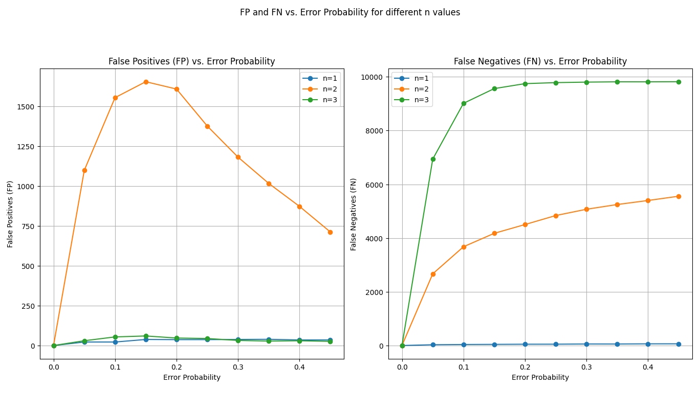 |
| error Probability range (0.0, 0.5, 0.05) | Data = tpc-h  Filter = normal   corruption = normal      | 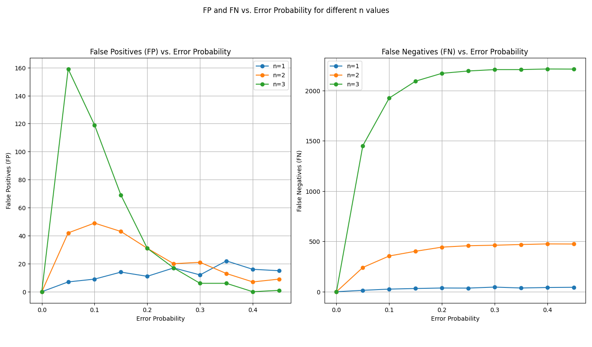 |

For numeric data n=1 an n=2 have very little FN compared to n=3.  
Alphabetic and printable data have the most FP at n=2. Filter not rough enough like n=1 but also not specific enough like n=3.   
Number of FP the highest at low error probability, then decreases. Few errors lead to different matches.  
Tpc-h result more similar to numeric result, although data is mixed numeric and alphabetic. Why? Maybe some percentage of numerical Data leads to this behaviour?

### FP vs. FN with second dataset

| Variables                                                                                         | Methods                                                          | Graphs                        |
|---------------------------------------------------------------------------------------------------|------------------------------------------------------------------|-------------------------------|
| N = 10 000  min_length = 5  max_length = 10  error Probability range (0.0, 0.5, 0.05) | Data = alphabetic  Filter = normal   corruption = normal | 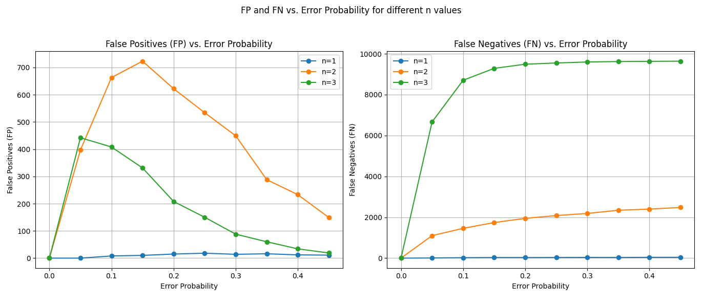 |
| N = 10 000  min_length = 5  max_length = 10  error Probability range (0.0, 0.5, 0.05) | Data = numeric  Filter = normal   corruption = normal    | 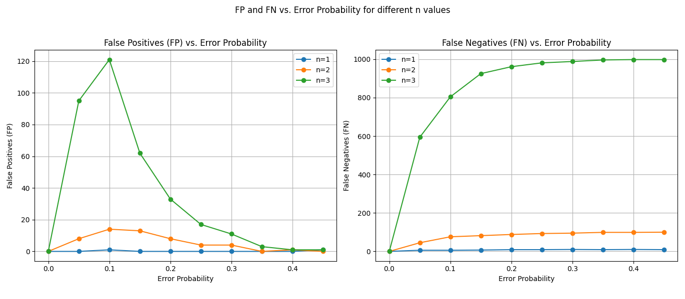 |
| N = 10 000  min_length = 5  max_length = 10  error Probability range (0.0, 0.5, 0.05) | Data = printable  Filter = normal   corruption = normal  | 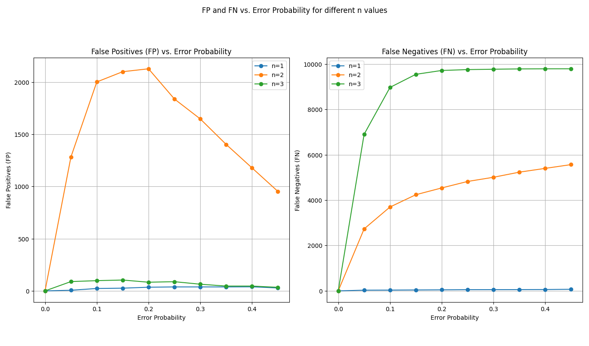 |

Similar behavior, but worse.   
How could this be mathematically described?

## FP vs. FN with redundant Prefixes

The Filter has the most common prefixes more than once.  
The results aren't better $\rightarrow$ calculation of the Confusionmatrix is wrong? More redundancy?

| Variables                                                                                         | Methods                                                             | Graphs                          |
|---------------------------------------------------------------------------------------------------|---------------------------------------------------------------------|---------------------------------|
| N = 10 000  min_length = 5  max_length = 10  error Probability range (0.0, 0.5, 0.05) | Data = alphabetic  Filter = redundant   corruption = normal | 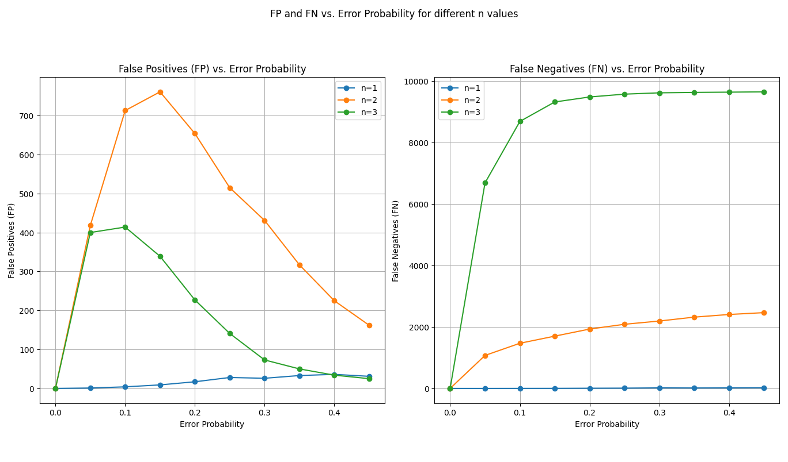   |
| N = 10 000  min_length = 5  max_length = 10  error Probability range (0.0, 0.5, 0.05) | Data = numeric  Filter = redundant   corruption = normal    | 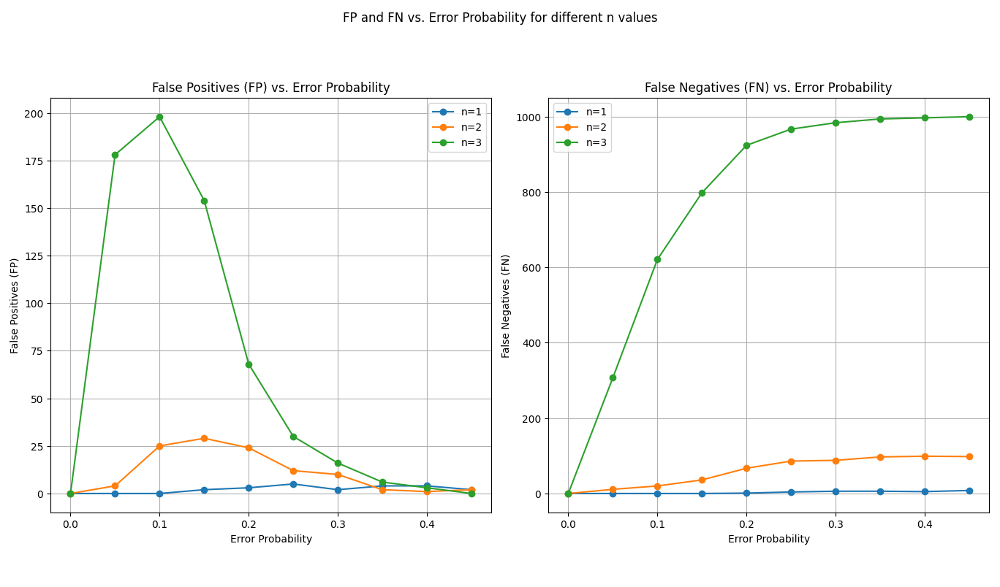   |
| N = 10 000  min_length = 5  max_length = 10  error Probability range (0.0, 0.5, 0.05) | Data = printable  Filter = redundant   corruption = normal  | 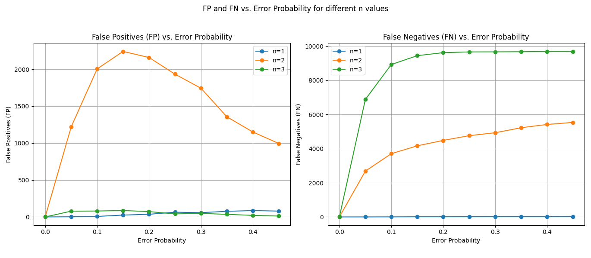 |
| error Probability range (0.0, 0.5, 0.05)  no second Data                                      | Data = tpc-h  Filter = redundant   corruption = normal      | 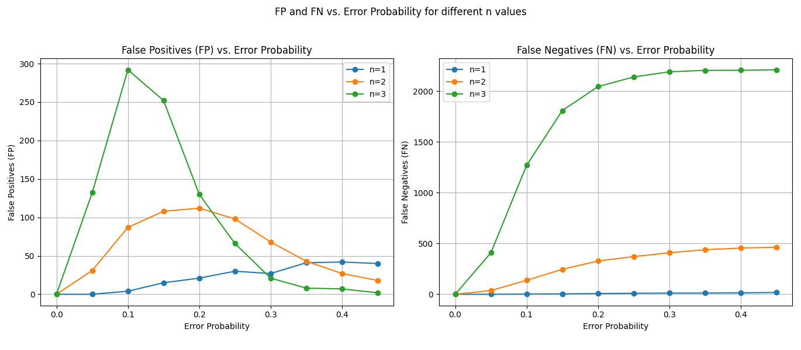 |

